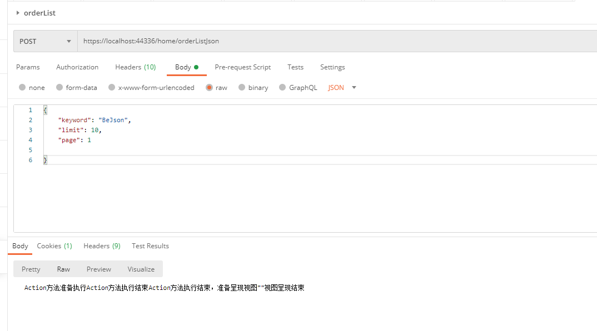
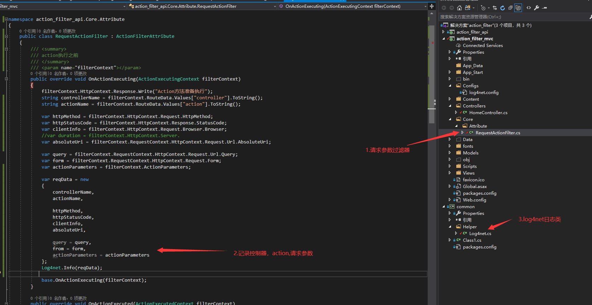
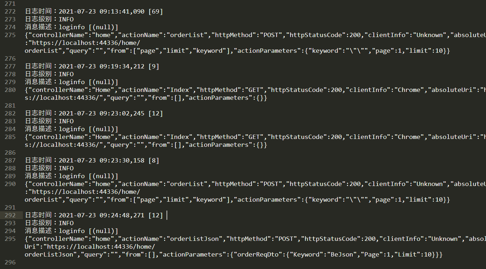

# ASP.NET MVC 过滤器ActionFilter 来拦截请求 记录请求的参数


> 现在都是前后端分离项目，或者是 ios,android接口请求。服务端如果没有请求参数的日志记录。需要前端来打印参数的话会很麻烦，还需要等待前端的同学调试好工具发过来。沟通效率也低。 所有准备在项目里面添加一个日志记录的功能，在测试环境下记录一下有需要的请求参数


<!-- more -->








### 主要代码

> OnActionExecuting 方法中代码

```C#
		/// <summary>
        /// 在执行 action方法之前 由 asp.net mvc调用
        /// </summary>
        /// <param name="filterContext"></param>
        public override void OnActionExecuting(ActionExecutingContext filterContext)
        {
            filterContext.HttpContext.Response.Write("Action方法准备执行");
            string controllerName = filterContext.RouteData.Values["controller"].ToString();
            string actionName = filterContext.RouteData.Values["action"].ToString();

            var httpMethod = filterContext.HttpContext.Request.HttpMethod;
            var httpStatusCode = filterContext.HttpContext.Response.StatusCode;
            var clientInfo = filterContext.HttpContext.Request.Browser.Browser;
            //var duration = filterContext.HttpContext.Server.
            var absoluteUri = filterContext.RequestContext.HttpContext.Request.Url.AbsoluteUri;

            var query = filterContext.RequestContext.HttpContext.Request.Url.Query;
            var form = filterContext.RequestContext.HttpContext.Request.Form;
            var actionParameters = filterContext.ActionParameters;

            var reqData = new
            {
                controllerName,
                actionName,

                httpMethod,
                httpStatusCode,
                clientInfo,
                absoluteUri,

                query = query,
                from = form,
                actionParameters = actionParameters
            };
            Log4net.Info(reqData);
           
            base.OnActionExecuting(filterContext);
        }
```

> 日志记录的结果

```json
  //日志时间：2021-07-23 09:24:48,271 [12] 
  //日志级别：INFO  
  //消息描述：loginfo [(null)] 
  {
  	"controllerName": "home",
  	"actionName": "orderListJson",
  	"httpMethod": "POST",
  	"httpStatusCode": 200,
  	"clientInfo": "Unknown",
  	"absoluteUri": "https://localhost:44336/home/orderListJson",
  	"query": "",
  	"from": [],
  	"actionParameters": {
  		"orderReqDto": {
  			"Keyword": "BeJson",
  			"Page": 1,
  			"Limit": 10
  		}
  	}
  }
```

  ### 组件

> 使用nuget包管理工具安装。

- log4net-[https://logging.apache.org/log4net/](https://logging.apache.org/log4net/) 日志记录逐渐
- [newtonsoft](https://www.newtonsoft.com/json)-将C#对象序列化为字符串方便记录到日志中

### 问题

- 如果解决方案中有两个项目。注意两个项目中的包引入的版本需要一致。不然可能会报错。
- ActionFilterAttribute 是在 namespace System.Web.Mvc 命名空间之下。所以这个特性标记的类型需要放在mvc的项目中使用。本来想移动到帮助类中。结果想法失败。

### 参考链接

- log4net用法[https://www.cnblogs.com/lsgsanxiao/p/5845300.html](https://www.cnblogs.com/lsgsanxiao/p/5845300.html) - 具体log4net用法的参考。这个不是这篇文章的主题。我就不具体写了。
- [MVC过滤器：自定义操作过滤器](https://www.cnblogs.com/dotnet261010/p/10859908.html)

### github 地址

- [https://github.com/AllenHongjun/my_code/tree/man/demo/action_filter](https://github.com/AllenHongjun/my_code/tree/man/demo/action_filter)

### 需改进的点

- 添加只有在异常报错的时候记录请求参数。
- 配合IF DEBUG标记 只有在测试环境下记录日志
- 日志文件中记录的 json格式 是压缩后的 还不是很直观。
- 增加 webapi ,asp.net core版本的请求过滤器来记录日志参数
- 项目名称使用_命名 开起来还是没有 大写字母命名来的舒服
