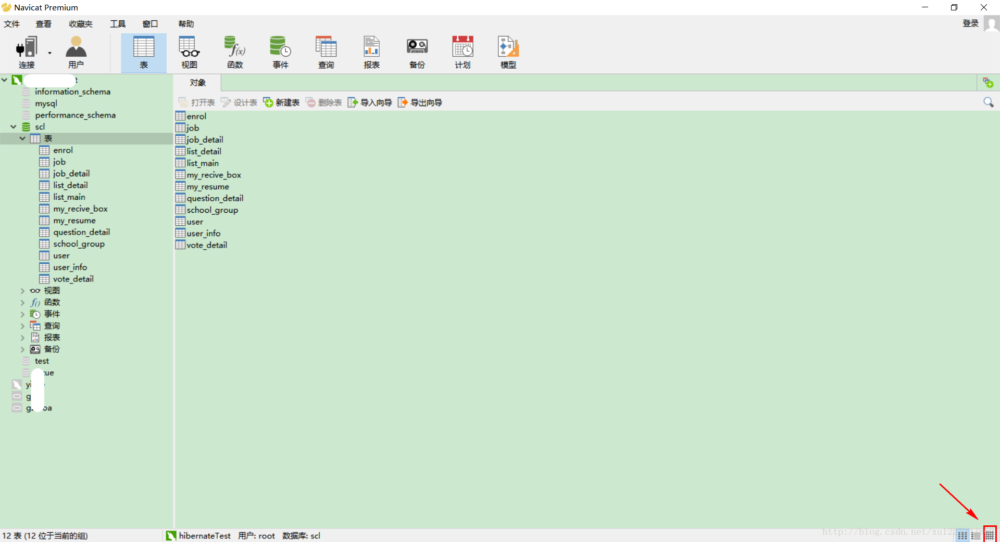
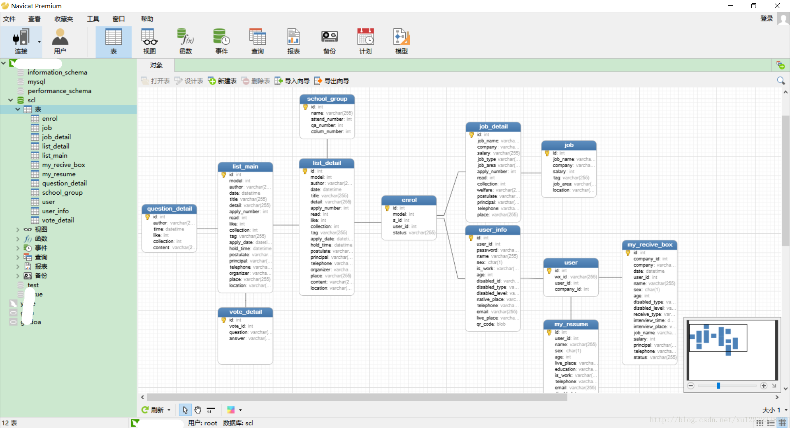
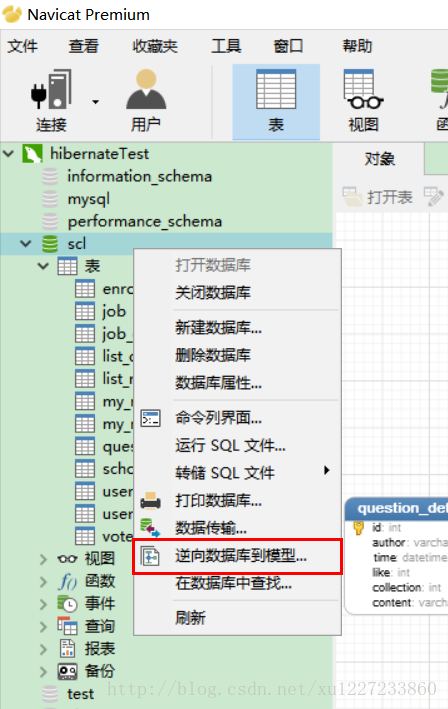
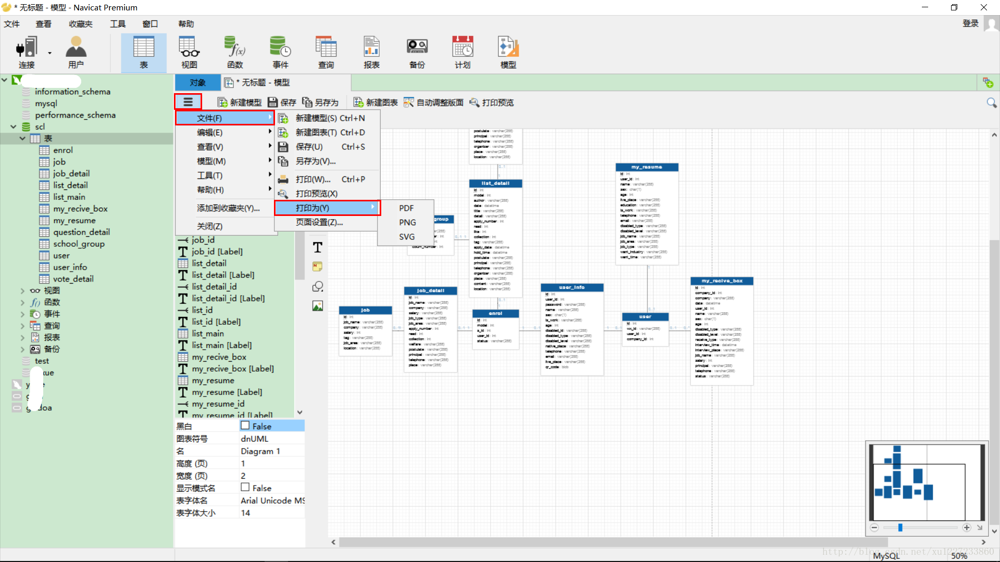

平时管理数据库一般都是用cmd命令提示符，或是IDEA Intellij自带的Data source，使用Navicat比较少。这段时间，由于要对前后端交互的数据结构进行设计，直接写文档联系多表时有些困难，想着如果有关系图就直观很多。想到Navicat本身就有这个功能，现在就去试试。

<!-- more -->

------

首先，我们打开已经设计好的表视图界面：

点击右下角的按钮切换到ER视图：

那些表与表之间相连接的就是外键，这个应该没问题。然后，我想到我要给领导汇报一下我的工作情况呀，直接截图截不完整不说，还很模糊。所以我想，会不会有什么办法可以将得到的关系图导出成pdf或者图片格式的文件呢？找了一会儿，发现确实有这个功能。

在数据库名字上，右击选择逆向数据库到模型。就可以看到生成的模型，可能会有些偏差，但是关系不会发生变化的。当然还可以在左边的工具栏选择对应的线条呀什么的，继续加工一下，然后就可以选择导出了。

导出格式有三种，pdf、svg和png，个人比较喜欢pdf，比较正式，一般什么要汇报给领导看的文档我都会先转成pdf，这样也比较清爽一些。emmm，生成ER关系图以及导出就是这些，如果帮助到你了，请点个赞吧！
