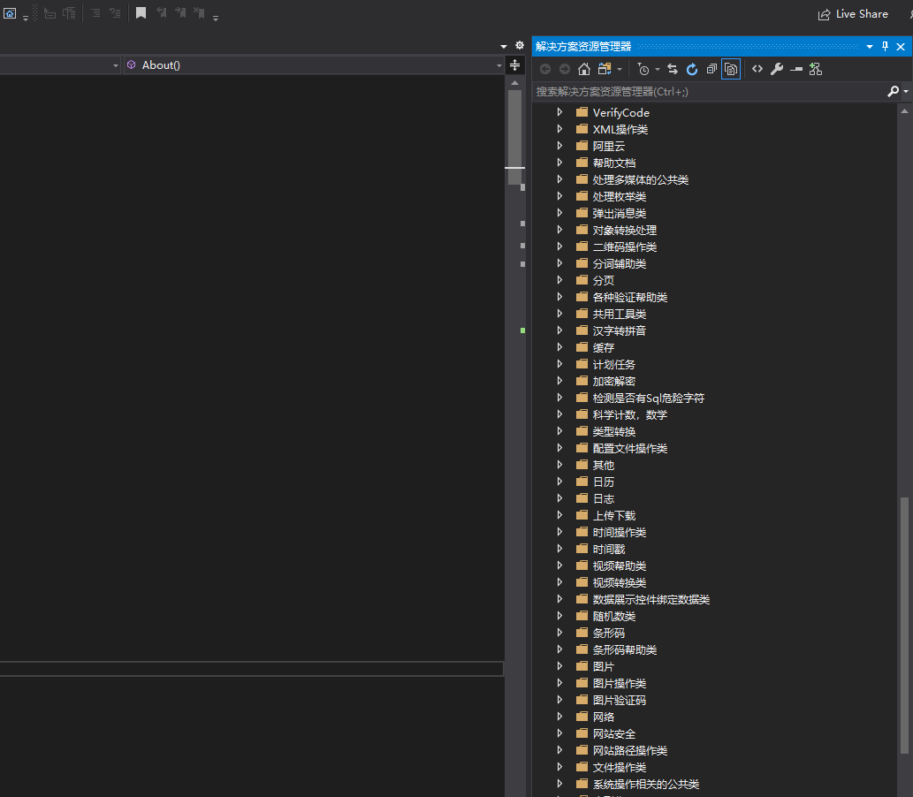
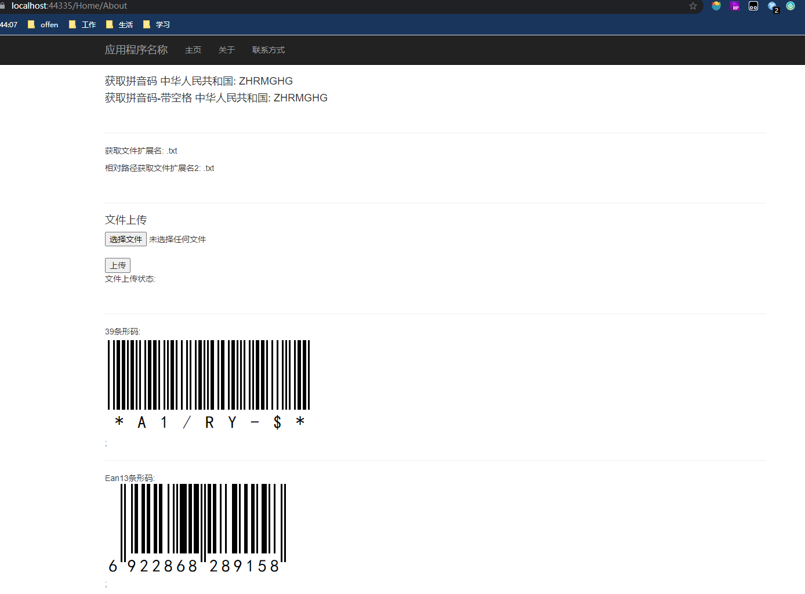
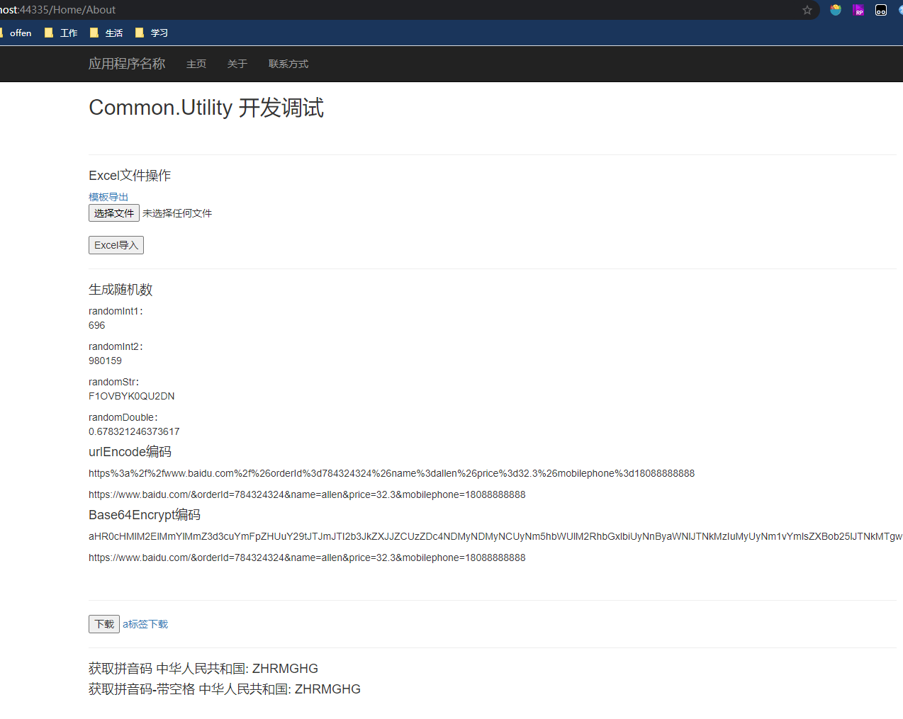
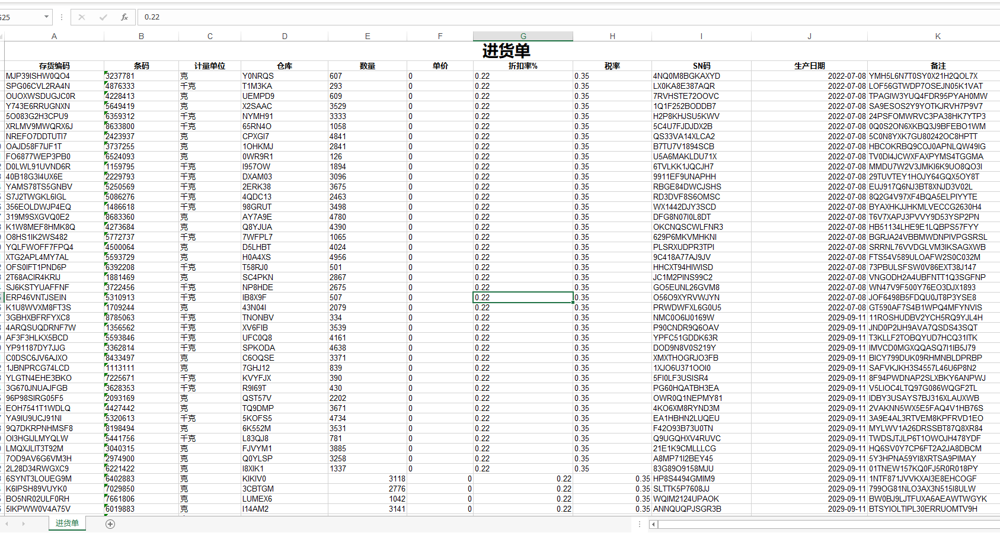

> 这个还是很强大的一个通用帮助类，有了它，感觉能做的事情有变了很多，而且也不要自己一个一个单独的去收集，这个类库有一种前端UIi组件的感觉，全部都封装好，然后直接调用，有需要的地方 然后再单独修改一下。 


<!-- more -->


- 梳理了一下帮助类的分类，方便以后查找使用


## 如何来使用 Utility

> 虽然说大部分的功能都是开箱即用，但是如果重来都没有用过，第一次上手，有些类库用起来还是不那么顺手的，比如会遇到，导出excel 不同的版本应该选择什么类库， 生成的二维码中间放logo,怎么变颜色， 文件，目录 上传操作应该调用什么帮助类等，总之有空余的时间 提前熟悉一下，总是好的。


### 学习资料

- [common.utility通用帮助类 github](https://github.com/Jimmey-Jiang/Common.Utility)


### 知识点

- [条形码-概念-维基百科](https://zh.wikipedia.org/wiki/%E6%9D%A1%E5%BD%A2%E7%A0%81)
- [什么是二维码?](https://baike.baidu.com/item/%E4%BA%8C%E7%BB%B4%E7%A0%81/2385673)
- [二维码中间放logo还能识别吗?](https://www.zhihu.com/question/20798376)
- [C# 文件目录操作复习](https://dyfloveslife.github.io/2017/06/17/File-and-directory-operations/)
- [xls和 xlsx的区别](https://zhuanlan.zhihu.com/p/353330601)
- [npoi](https://github.com/nissl-lab/npoi) a .NET library that can read/write Office formats without Microsoft Office installed. No COM+, no interop.  一个能够操作 excel的类库


### 部分类调用代码演示


```c#
        // 时间日期
        DateTime dt = DateTime.Now.AddMonths(-3);
        var dayOfWeek = dt.DayOfWeek;
        int dayOfYear = dt.DayOfYear;


        TimeHelper timeHelper = new TimeHelper();
        string dtFormat1 =  timeHelper.GetFormatDate(dt, '-');
        string timeFormat = timeHelper.GetFormatTime(dt, ':');

        int second = 1502;
        int minite = TimeHelper.SecondToMinute(second);

        int lastDay = TimeHelper.GetMonthLastDate(2088, 5);


        DateTime dt1 = new DateTime(2028, 2, 3);
        DateTime dt2 = new DateTime(2032, 12, 9);
        string dateDiff = TimeHelper.DateDiff(dt1, dt2);
        TimeSpan timeSpan = TimeHelper.DateDiff2(dt1, dt2);

        string formatDate = TimeHelper.FormatDate(dt1, "0");
        DateTime randomDate = TimeHelper.GetRandomTime(dt1, dt2);


        // 随机数
        BaseRandom baseRandom = new BaseRandom();
        int randomInt1 = baseRandom.GetRandom();
        int randomInt2 = baseRandom.GetRandom(50000, 999999);
        string randomStr = baseRandom.GetRandomString(13);

        Random random = new Random();
        double randomDouble =  random.NextDouble();

        ViewBag.randomInt1 = randomInt1;
        ViewBag.randomInt2 = randomInt2;
        ViewBag.randomStr = randomStr;
        ViewBag.randomDouble = randomDouble;


		/// <summary>
        /// 文件操作
        /// </summary>
        private void FileOperator (){
            // 文件操作。  删除，创建目录，写入文件。写日志。生成二维码。写入图片。返回图片路径。

            string existFile1 = Server.MapPath("/dir/test2.txt");
            string existFile2 = System.AppDomain.CurrentDomain.BaseDirectory + "/dir/test3.txt";

            DirFile.ExistsFile(existFile1);
            DirFile.ExistsFile(existFile2);

            string fileExtension =  DirFile.GetExtension(existFile1);
            string fileExtension2 = DirFile.GetExtension("./dir/text3.txt");
            ViewBag.fileExtension = fileExtension;
            ViewBag.fileExtension2 = fileExtension2;


        }


		/// <summary>
        /// 生成中间带图片的二维码
        /// </summary>
        private void GenerateQrcode()
        {
            // 生成二维码到指定的路径
            QRcode qrCode = new QRcode();
            var userQrCode = qrCode.Create("https://cn.ubuntu.com/", 4, "/Content/Images/QrCode/");
            ViewBag.UserQrCode = userQrCode;

            // 二维码中间放图片
            var qrCodePath = Request.MapPath(userQrCode);
            var logoPath = Request.MapPath("~/Content/Images/ubuntu.png");
            System.Drawing.Image image = System.Drawing.Image.FromFile(qrCodePath);
            System.Drawing.Image combinImage = QRcode.CombinImage(image, logoPath);


            // 保存合成的图片，将路径输出到界面
            string filename = "~" + "/Content/Images/QrCode/" + Guid.NewGuid() + ".jpg";
            combinImage.Save(Request.MapPath(filename));
            var fileCombinUrl = filename.Replace("~", "");
            ViewBag.fileCombinUrl = fileCombinUrl;
        }
  


		/// <summary>
        /// 导出Excel 模板数据
        /// </summary>
        public void ExportTemplate()
        {   
            // TODO: 增加一个sheet来说明导出注意事项的功能，修改Export方法。来增加一个sheet
            #region 生成测试DataTable数据 正式环境 从数据库中读取，在转换为DataTable格式导出
            DataTable dataTable = new DataTable();
            dataTable.Columns.Add("item_no", typeof(string));
            dataTable.Columns.Add("barcode", typeof(string));
            dataTable.Columns.Add("unit", typeof(string));
            dataTable.Columns.Add("ware_house", typeof(string));
            dataTable.Columns.Add("quantity", typeof(int));
            dataTable.Columns.Add("price", typeof(decimal));
            dataTable.Columns.Add("discount_rate", typeof(decimal));
            dataTable.Columns.Add("tax_rate", typeof(decimal));
            dataTable.Columns.Add("sn", typeof(string));
            dataTable.Columns.Add("manufacture_date", typeof(DateTime));
            dataTable.Columns.Add("remark", typeof(string));

            Random r = new Random();
            BaseRandom baseRandom = new BaseRandom();
            for (int i = 0; i < 1000; i++)
            {
                DataRow row = dataTable.NewRow();

                row["item_no"] = baseRandom.GetRandomString(13);
                row["barcode"] = baseRandom.GetRandom(1000000, 9000000).ToString();
                row["unit"] = r.Next(2) % 2 == 0 ? "千克" : "克";
                row["ware_house"] = baseRandom.GetRandomString(6);
                row["quantity"] = r.Next(5000).ToString();
                row["discount_rate"] = 0.22.ToString();
                row["tax_rate"] = 0.35.ToString();
                row["sn"] = baseRandom.GetRandomString(13);
                row["manufacture_date"] = TimeHelper.GetRandomTime(DateTime.Now.AddYears(-10), DateTime.Now.AddYears(10)).ToString();
                row["remark"] = baseRandom.GetRandomString(23);

                dataTable.Rows.Add(row);
            }

            //DataTable的列名和excel的列名对应字典，因为excel的列名一般是中文的，DataTable的列名是英文的，字典主要是存储excel和DataTable列明的对应关系，当然我们也可以把这个对应关系存在配置文件或者其他地方
            Dictionary<string, string> dir = new Dictionary<string, string>();
            dir.Add("item_no", "存货编码");
            dir.Add("barcode", "条码");
            dir.Add("unit", "计量单位");
            dir.Add("ware_house", "仓库");
            dir.Add("quantity", "数量");
            dir.Add("price", "单价");
            dir.Add("discount_rate", "折扣率%");
            dir.Add("tax_rate", "税率");
            dir.Add("sn", "SN码");
            dir.Add("manufacture_date", "生产日期");
            dir.Add("remark", "备注"); 
            #endregion

            
            string fileName = "导入模板-进货单" + DateTime.Now.ToString("yyyy-MM-dd-HH-mm-ss")+".xls";
            NPOIHelper.ExportByWeb(dataTable, "进货单", fileName, dir);

            //string excelTemplateName = @"~\Content\Files\ExcelTempalte" + "进货单" + ".xls";
            //NPOIHelper.Export(dataTable, "考勤信息表", dir, Server.MapPath( excelTemplateName));


        }
```


### 使用效果


> 展示部分通用帮助类




> 生成拼音码 39码 条形码



> 生成随机数，编码操作， excel 导入导出等



> 导出Excel表格


