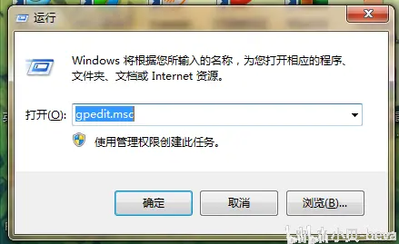
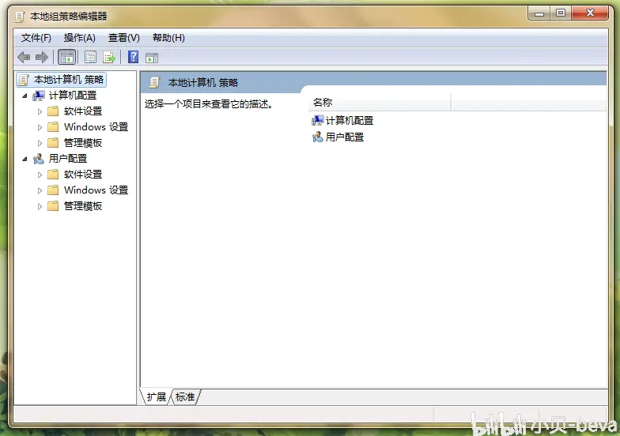
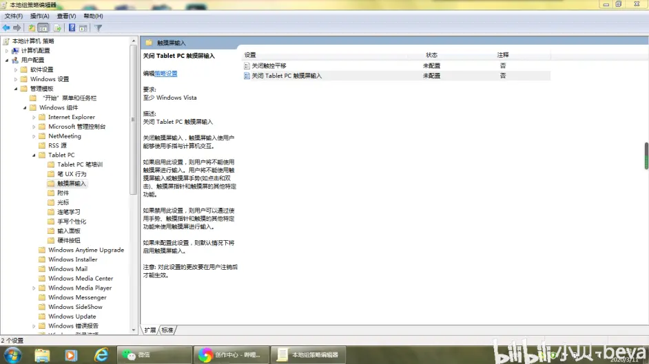
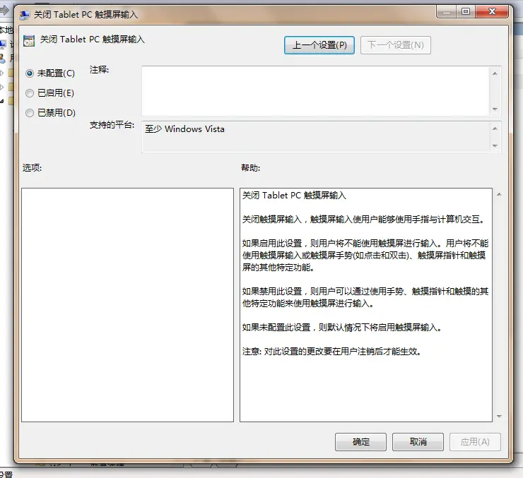
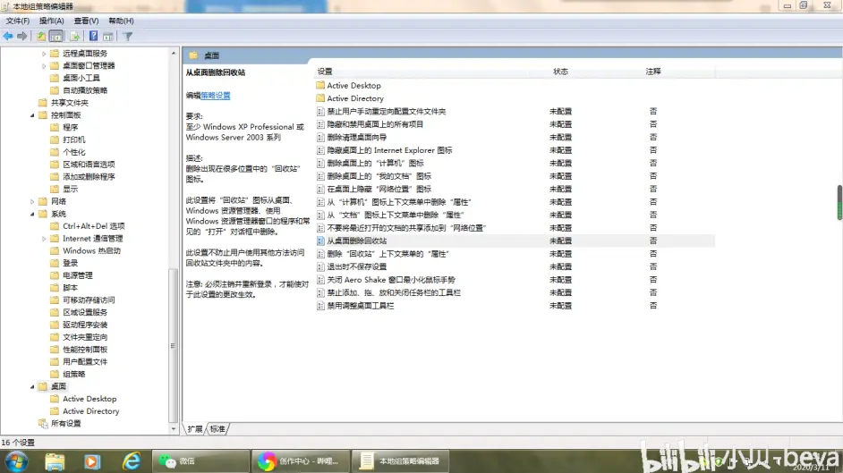
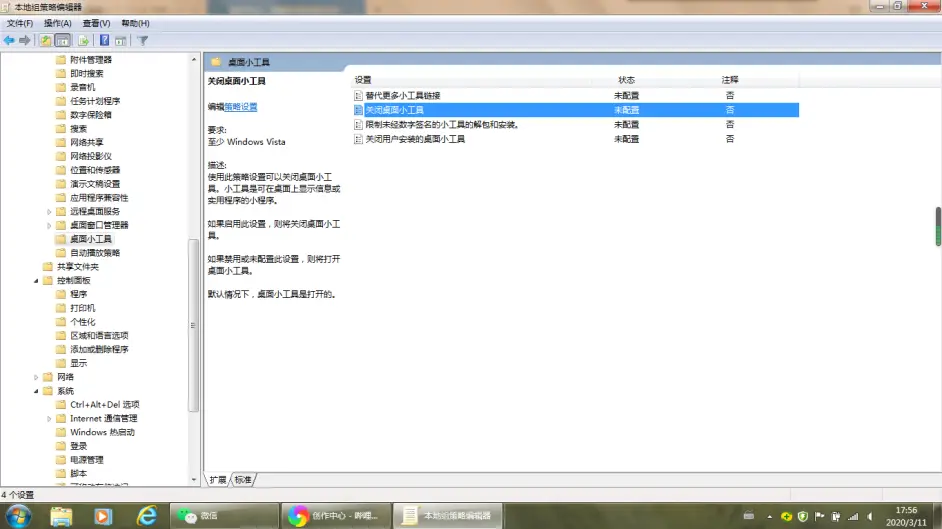
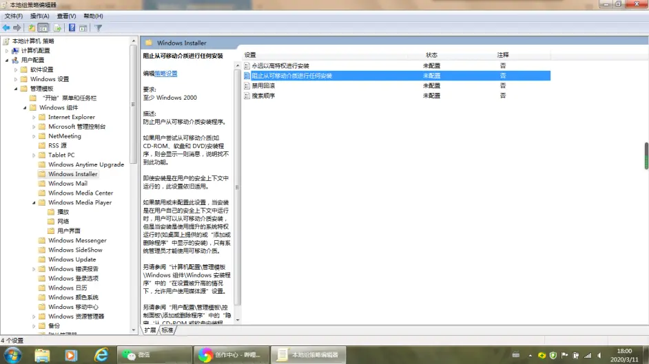
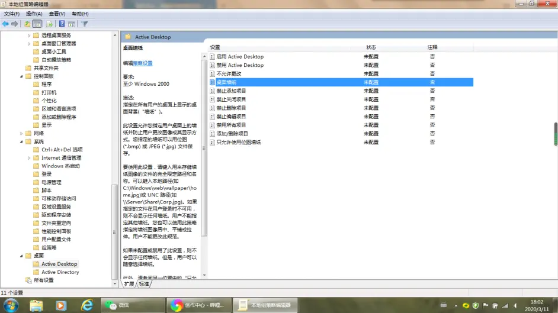
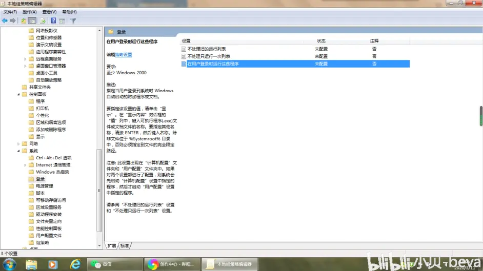

> Windows可谓是世界上最流行的电脑操作系统。但是你对Windows的设置了解多少？在Windows10之前，控制面板就是通用设置，到了Windows10后，又出现了一个真正意义上的“设置”应用，与控制面板并存。
> 但是，你不能忘了最高级别的Windows设置——组策略。
> 顾名思义，策略可以控制计算机运行什么，不能运行什么。这一功能在某些大公司里面被广泛应用。这些公司发给员工的电脑里面，早已经动了手脚——使用组策略改了一些重要设置。
> 但如果你的电脑是自己买的，或者是公司发的且没有动手脚的，可以打开组策略自己探索如何使用。

<!-- more -->

### 你听说过Windows组策略吗？

1.打开方式

    从开始菜单里面点击“运行”（或者按Windows徽标+R键），然后输入gpedit.msc，按下回车键（或者点击确定键），等几秒钟就可以了。

组策略的启动方式

    **注意：运行的调动和组策略的操作都要是管理员账户才能使用。**
    
    组策略面板如下：

本地组策略管理器

2.使用方法

    组策略的功能很强大，它可以显示一般方法找不到的设置项。因此有个断言：“如果电脑有各种疑难杂症，首先想到的是组策略”。有的病毒程序发作时，也会打开用户的组策略，然后更改里面的设置，致使电脑瘫痪。
    
    左栏是策略分组的树状图，右栏是控制这些策略的选项。如果想控制计算机上所有用户的行动，选择“计算机管理”，如果要控制当前账户的用户行动，选择“用户管理”。
    
    这里我想介绍几个常用的功能。

1.班主任控制学生使用智能白板触摸功能的“神器”——组策略。

    现在很多学校都装了智能白板，用手触摸几下就可以代替鼠标，多方便！但也成了影响学生成绩的一个因素——学生下课都在玩智能白板，刷B站，玩4399，追爱5……那么身为班主任的你，怎么控制他们玩智能白板呢？
    
    其实打开组策略后，找到如图所示的目录，然后双击右边的“关闭Table PC触屏输入”，选择“已启用”，点击确定，这时智能白板就不能使用触摸功能了，只能接入鼠标操控。

>     关闭触摸屏输入，触摸屏输入使用户能够使用手指与计算机交互。
>
>     如果启用此设置，则用户将不能使用触摸屏进行输入。用户将不能使用触摸屏输入或触摸屏手势(如点击和双击)、触摸屏指针和触摸屏的其他特定功能。
>
>     如果禁用此设置，则用户可以通过使用手势、触摸指针和触摸的其他特定功能来使用触摸屏进行输入。
>
>     如果未配置此设置，则默认情况下将启用触摸屏输入。
>
>     注意: 对此设置的更改要在用户注销后才能生效。

    但如果这篇文章被学生看到了，或者有的同学带鼠标了，估计这一招就不灵了。

2.桌面某些图标的永久隐藏

    如图所示的界面，可以显示或者永久隐藏桌面图标，且在控制面板中找不到打开的选项。

    这一功能很好用，比如你想在删除文件后想不再放入回收站，可以选择如图所示的选项。

3.关闭桌面小工具

    微软曾经通报过桌面小工具存在严重的漏洞，并且在后续的Windows版本里面删除了小工具的功能。不过在Windows7里你可以通过组策略把小工具禁用。

    我曾经发布过一个桌面小工具的教程，如果你没法添加的话可以进入组策略修改设置。

4.阻止安装程序

    某些公司可以通过这个选项阻止员工的电脑任意下载应用程序。

5.强制某一个桌面壁纸

    某些大公司会这么做，其实就是一个烙印呗。甚至可以设置壁纸文件的服务器地址，远程控制桌面背景的设置。

6.开机立即启动某一程序

    可以设置一些不支持开启启动的程序启动。

    组策略的功能很强大，这里只是介绍了很小的一部分，希望各位读者慢慢探索其他内容，实在不会的话最好看一下帮助。

需要注意的是：

1. 某些选项仅在特定的Windows版本中使用，注意左栏说明。
2. 建议专业的IT人士操作，个人用户要仔细阅读说明后了解每个选项开启后带来的影响。
3. 如果是大公司为员工采购电脑后启用此功能，则电脑要设置两个用户账户：一个是带密码的管理员账户，供IT人员使用；一个是不带密码的标准用户，供员工使用。
4. 购买二手电脑时，最好问问卖家是否设置了组策略，买来后最好重装系统。
