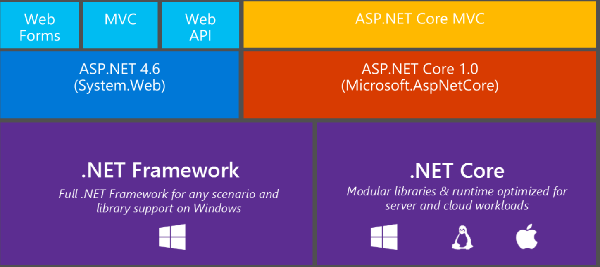
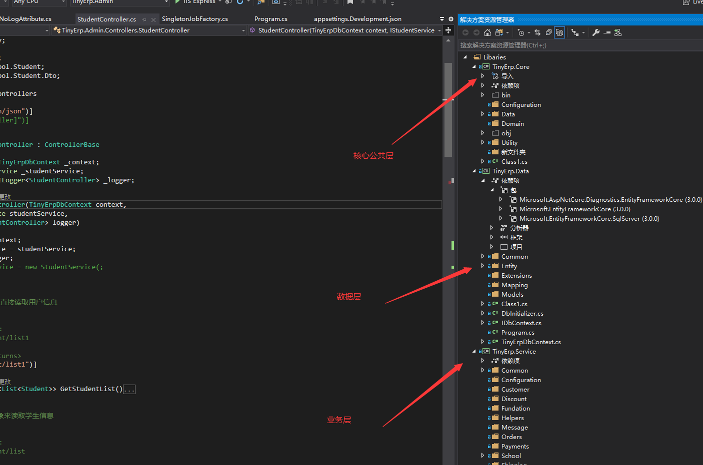
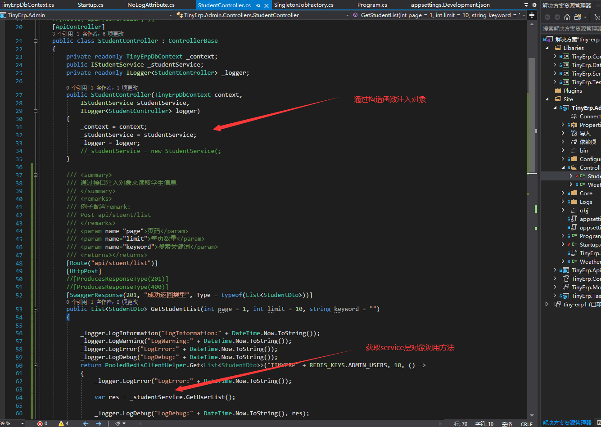
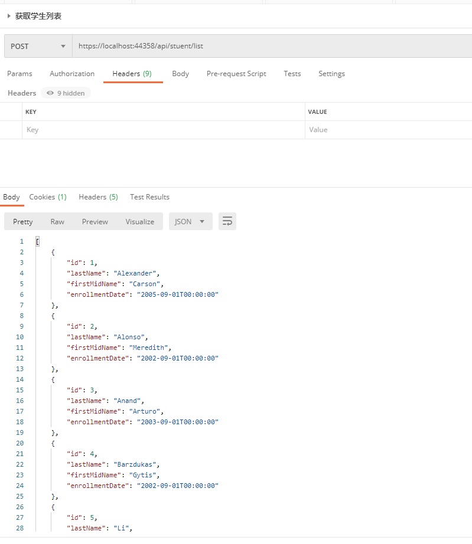

# Auto FAC 7.0 , Web API Core 3.0 搭建三层项目框架  学习笔记

> 这是一个搭建三层项目基础架构的笔记。搭建这个框架的原因有下面三点:
>
> 为了向学习 比较新的 asp.net core框架，配合 EF core auto fac 依赖注入 搭建一个最基础的三层项目架构
>
> 为了搭建一个自己的小的脚手架项目，方便以后开发使用
>
> 为了能够增加对项目的理解，同时也是巩固以前学习和用过的一些知识点，来做一个实践

 

<!-- more -->





## 为什么要用依赖注入框架


- [如何用最简单的方式解释依赖注入？依赖注入是如何实现解耦的?](https://www.zhihu.com/question/32108444/answer/309208647)
- 可以实现 表现层，业务层，数据层的解耦
- 可以不用自己管理对象。方便。
- 避免重复造轮子。


## 如何来搭建


### 官方资料

- [asp.net core webapi 3.0](https://dotnet.microsoft.com/apps/aspnet/apis)
- [Entity Framework Core 3.0]()
- [autofac 6.0](https://autofac.org/)
- [autofac 官方文档](https://autofac.readthedocs.io/en/stable/getting-started/index.html)
- [ASP.NET Core 依赖注入](https://docs.microsoft.com/zh-cn/aspnet/core/fundamentals/dependency-injection?view=aspnetcore-5.0)  asp.net 框架自带的依赖注入教程
- [awesome-dotnet-core](https://github.com/jasonhua95/awesome-dotnet-core#%E6%B6%88%E6%81%AF%E9%98%9F%E5%88%97)


### 部署教程

### asp.net 三层项目如何搭建

- [asp.net框架封装](https://mp.weixin.qq.com/s?__biz=MzIxNjIwNzQ5Mw==&mid=502276804&idx=1&sn=7925d916c13a1ba828c09f8356a60c9f&chksm=0f881b2e38ff9238fd352c7fd3ca00edefec73d7d421754ed5895dc69087c621869a2332b9dd#rd)

- [ASP.NET Core搭建多层网站架构1-项目结构分层建立](https://www.cnblogs.com/kasnti/p/12236593.html)

- [ .Net Core +EF Core+Log4Net基本三层架构搭建](https://blog.csdn.net/qq_33101689/article/details/107363465)

####   asp.net web api 框架如何引入 auto FAC 框架

- [.Net core 3.1 AutoFac配置及各种注册方式](https://blog.csdn.net/qq_38436796/article/details/111410201)

- [.NET Core Autofac 4.0的配置和使用示例代码](https://www.cjavapy.com/article/253/)

- [官方的依赖注入](https://docs.microsoft.com/zh-cn/aspnet/core/fundamentals/dependency-injection?view=aspnetcore-3.0)

- [autofac .net-core 依赖注入](https://www.cnblogs.com/sdonian/p/12918167.html)

  - 依赖注入核心代码
  
  
  
   ```csharp
    public static IHostBuilder CreateHostBuilder(string[] args) =>
                Host.CreateDefaultBuilder(args)
                    .ConfigureLogging((context, loggingBuilder) =>
                    {
                        loggingBuilder.AddFilter("System", LogLevel.Information);
                        loggingBuilder.AddFilter("Microsoft", LogLevel.Information);
                        var path = context.HostingEnvironment.ContentRootPath;
                        loggingBuilder.AddLog4Net($"{path}/Configuration/log4net.config");//配置文件
                    })
                    .ConfigureWebHostDefaults(webBuilder =>
                    {
                      webBuilder.UseStartup<Startup>();
                        // 此处配置使用 autoFac服务
                    }).UseServiceProviderFactory(new AutofacServiceProviderFactory());
    
    
    public void ConfigureContainer(ContainerBuilder builder)
            {
                Assembly service = Assembly.Load("TinyErp.Service");
                Assembly data = Assembly.Load("TinyErp.Data");
                builder.RegisterAssemblyTypes(service, data)
            .Where(t => (t.FullName.EndsWith("Service") || t.Name.EndsWith("Repository") ) && !t.IsAbstract) //类名以service结尾，且类型不能是抽象的　
                    .InstancePerLifetimeScope() //生命周期，，
                    .AsImplementedInterfaces()
                .PropertiesAutowired(); //属性注入
                    builder.RegisterGeneric(typeof(GenericRepository<>)).As(typeof(IGenericRepository<>)).AsImplementedInterfaces().InstancePerLifetimeScope();
                    builder.RegisterType(typeof(TinyErpDbContext)).As(typeof(DbContext)).InstancePerLifetimeScope();
    builder.RegisterType(typeof(UnitOfWork)).As(typeof(IUnitOfWork)).InstancePerLifetimeScope();
    
                //如果需要在controller中使用属性注入
                var controllerBaseType = typeof(ControllerBase);
                builder.RegisterAssemblyTypes(typeof(Program).Assembly)
                .Where(t => controllerBaseType.IsAssignableFrom(t) && t != controllerBaseType)
                .PropertiesAutowired();
    
            }
  
  
         [SwaggerResponse(201, "成功返回类型", Type = typeof(List<StudentDto>))]
          public List<StudentDto> GetStudentList(int page = 1,int limit = 10, string keyword = "")
          {
  
              _logger.LogInformation("LogInformation:" + DateTime.Now.ToString());
              _logger.LogWarning("LogWarning:" + DateTime.Now.ToString());
              _logger.LogError("LogError:" + DateTime.Now.ToString());
              _logger.LogDebug("LogDebug:" + DateTime.Now.ToString());
              return PooledRedisClientHelper.Get<List<StudentDto>>("TINYERP" + REDIS_KEYS.ADMIN_USERS, 10, () =>
              {
                  _logger.LogError("LogError:" + DateTime.Now.ToString());
                 // 通过依赖注入的 _studentService 来查询获取数据
                  var res = _studentService.GetUserList();
  
                  _logger.LogDebug("LogDebug:" + DateTime.Now.ToString(), res);
                  return res;
              });
              
          }
   ```
  
  


#### asp.net 如何引入 EF core

- [使用mvc的EF-core](https://docs.microsoft.com/zh-cn/aspnet/core/data/ef-mvc/intro?view=aspnetcore-5.0)  微软官方教程

- [MVC + EFCore 项目实战 - 数仓管理系统2- 搭建基本框架配置EFCore](https://www.cnblogs.com/miro/p/13258843.html)

- [.Net Core2.2 + EF Core + DI，三层框架项目搭建教程](https://www.cnblogs.com/han1982/p/11058788.html) https://www.cnblogs.com/han1982/p/11058788.html

   

   

   

   ```csharp
    // 初始化创建数据库 
    private static void CreateDbIfNotExists(IHost host)
     {
         using (var scope = host.Services.CreateScope())
         {
             var services = scope.ServiceProvider;
             try
             {
                 var context = services.GetRequiredService<TinyErpDbContext>();
                 DbInitializer.Initialize(context);
             }
             catch (Exception ex)
             {
                 var logger = services.GetRequiredService<ILogger<Program>>();
                 logger.LogError(ex, "An error occurred creating the DB.");
             }
         }
     }
     
    // 创建DBContext
     public class TinyErpDbContext:DbContext
        {
            public TinyErpDbContext(DbContextOptions<TinyErpDbContext> options):base(options)
            {
            }
    
            public DbSet<Course> Courses { get; set; }
            public DbSet<Enrollment> Enrollments { get; set; }
            public DbSet<Student> Students { get; set; }
    
            protected override void OnModelCreating(ModelBuilder modelBuilder)
            {
                modelBuilder.Entity<Course>().ToTable("Course");
                modelBuilder.Entity<Enrollment>().ToTable("Enrollment");
                modelBuilder.Entity<Student>().ToTable("Student");
            }
        }
    
    
   ```

    


### ASP.NET 常用开发框架有哪些

- [abp](https://abp.io/) ABP 使用人数还是蛮多的，整合了很多流行的技术组件和框架。而且也是专门设计了架构，不同我觉得最后自己也能对用到的组件有一个了解，能够独立搭建，不然直接使用框架，遇到问题，有时候也会没有头绪，因为很多概念，知识点都没有遇到过。

- [asp.net web开发框架](https://www.zhihu.com/question/366937369)

- [furion-开发框架](https://dotnetchina.gitee.io/furion/)

- [smart-store](https://github.com/smartstore/SmartStoreNET/tree/4.x/src/Plugins)  


## 遇到的坑

- [对象无法依赖注入](https://stackoverflow.com/questions/48705473/net-core-2-0-autofac-register-class-instanceperrequest-doesnt-work)
- [什么是三层架构](https://baike.baidu.com/item/%E4%B8%89%E5%B1%82%E6%9E%B6%E6%9E%84/11031448) 理解三层架构的概念
- [子类继承父类 。为什么 子类一定要提供和父类构造函数一样的参数。？ 这个是什么语法点。](http://bbs.itheima.com/forum.php?mod=viewthread&tid=123305&page=1#pid791045)


```csharp
// 这一步 
public class StudentService : EntityService<Student>, IStudentService
    {
        public IUnitOfWork unitOfWork;
        public IGenericRepository<Student> studentRepository;
        public StudentService(IUnitOfWork unitOfWork, IGenericRepository<Student> studentRepository) : base(unitOfWork, studentRepository)
        {
            this.unitOfWork = unitOfWork;
            this.studentRepository = studentRepository;
        }
    }
```


### 效果展示

> 三层项目架构目录结构

  


> 通过控制器中通过构造函数注入对象

 


> 调用注入对象的接口，成功获取数据

 
