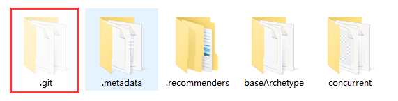

## 一、安装

### 1、安装git Windows 客户端—GitHub Desktop

具有git功能的Windows客户端软件有很多，如：git for windows（以前的msysGit）、TortoiseGit、GitHub Desktop（以前的GitHub for Windows）等

<!-- more -->

- **git for windows
  **git 原产于 Linux，要在 Windows 上运行，需要移植。git for windows就是一个这样的移植项目。它移植的不仅仅是一个程序，而是在 Windows 上模拟出了一个 Linux 环境。它有两种运行方式：命令行方式（专家使用）、图形界面方式（菜鸟使用）。
  git for windows 的[下载网址
  git for windows是一个开源项目，](https://git-for-windows.github.io/)[下载源代码](https://github.com/msysgit/msysgit)
- **TortoiseGit
  **TortoiseGit只是一个图形界面程序，它内部调用的还是git for windows。所以，使用TortoiseGit之前需要安装git for windows。
  TortoiseGit最大的优势在于与TortoiseSVN的操作比较相同，熟悉SVN的用户可快速上手。
- **GitHub Desktop
  这是**[**Github**](https://link.jianshu.com/?t=https%3A%2F%2Fdesktop.github.com)**的官方git软件。**GitHub Desktop 跟TortoiseGit一样，内部也会调用git for windows。它的操作是这三款软件中最简单的，安装之后无需配置就可使用，非常适合菜鸟。
  GitHub Desktop的[下载网址](https://desktop.github.com/)。下载下来的文件GitHubSetup.exe是一个在线安装程序，有可能无法正常安装。
  可下载离线安装包，[下载网址](http://pan.baidu.com/s/1Hkewm)。下载GitHub_3_0_5_2.zip，解压后运行GitHub.application即可安装。
  注意：如果离线安装程序无法运行，就需要先安装.NET Framework 4.5。可先运行在线安装程序GitHubSetup.exe，安装.NET Framework 4.5。然后再运行离线安装程序。
  []

### 2、注册GitHub账户

要上传开源代码至GitHub.com，需要在该网站上注册一个账户。请浏览[GitHub网站](https://github.com/)，单击"Sign up"按钮注册账户。

## 二、操作介绍

如果你打开这个软件后，如下所示。

[]

### 1、创建一个本地仓库

好了现在我们直接在我的github上面克隆一个仓库并且在桌面打开，这个仓库已经初始化好了，所以不需要任何命令

[]

选择本地仓库地址

[]

Github Desktop果然是亲儿子， 在网站下载会自动克隆到Github Desktop中，

界面介绍：左边的是可以切换添加进来的仓库，再也不需要cd来cd去了，白色框内是改变提醒，下面是提交修改。所以整个工作流程是有修改直接commit就行了。

[]

那如果没有自动导入怎么办内，假如你的learngit文件夹在桌面上，可以添加本地仓库，这是一样的

[]

### 2、布本地仓库到GitHub

[]

[]

按照提示登录GitHub账号，可以使用浏览器校验或直接输入账号密码。

[]

发布成功。

[]

### 3、提交改变

好了咱们已经有了本地仓库了，那么现在当然是什么改变都没有，也不需要提交什么。

在本地仓库中新增learn2.txt文件，并在其中添加一行learning git is easy.看看有什么变化吧！

[]

看到了吧，已经显示了新添加了改变，那现在就可以在summary写上简短的改变描述，比如我写的是add learn git is easy之后点击commit to master就可以了。

[]

看到了吧，现在显示本地没有改变，但是上面push origin显示了1，代表的是我们与远程的github不同步，本地有一个更新，就是我们新加的文件，但是github并没有更新，推送远程分支我之后会讲。

[]

### 4、送到远程仓库

登陆后就可以推送啦， 点击push origin就可以啦～

[]

你可以登陆github查看learngit仓库，看看其中的变化

[]

是不是和我们在github desktop里看到的一样呢？

### 5、更新本地仓库

比如说现在远程仓库已经被更新了，有可能是你的同事提交了他的一部分，但是在你的本地仓库并没有更新，现在怎么办呢？ 很简单，一键fetch

把easy改成了difficult

[]

这时候点击fetch origin

[]

可以看到下面的pull origin

[]

好啦～点击pull origin就可以把远程的difficult更新到本地了~ 看看里面的history就知道干了些什么了。

[]

### 6、版本回退

有很多时候我们在当前这一步骤做了一些不可挽回的错误，比如说删除了重要的文件以后再也找不到了，这时候使用版本回退可以回退到任何一个commit过的状态。 现在看看咱们的文件夹都有哪些文件？

比如说我们不小心删除了learn2.txt，这个文件非常重要，怎么样回复到之前存在的状态呢？

[]

打开history你会发现有很多commit后的历史记录,其中有我们之前的update learn2.txt。所以右键它会显示revet this commit

[]

好了，现在看看你的文件夹吧 :> 是不是回来了呢？

[]

### 7、创建分支

什么是分支呢？就像本篇文章刚开始提到的分支是用来创建新功能但是你又不希望破话现在的成果，害怕会对现在的进度造成影响，所以是一种试验性的功能。

那怎么创建呢？ 这也是很简单的，打开首页的current branch会看到default branch是master，这是所有git仓库的默认主分支，都叫master，origin是你github的分支，关联的是服务器端。[]

我们尝试创建一个新的分支，点击new，创建一个名为create_learn3的分支

[]

如果你现在仔细观察的话会发现原来的master分支变成了create_learn3，这说明我们当前处于create_learn3的分支里

[]

当然了我们会在这个分支里创建一个learn3.txt的文件

[]

好了你看到我创建了一个learn3的文件，接下来就是提交我们的改变，让git记住当前分支的状态

[]
现在如果我们切换回master分支

[]

然后查看文件夹，你会发现神奇的事

[

竟然没有我们刚刚创建的create_learn3.txt，这是因为我们在create_learn3分支里提交了改变，**现在比master分支早一个commit**. 你现在知道分支的作用了吧！

它不会改变我们主分支，如果你在其他分支创建commit，它只会改变其他分支的状态，而对于master状态不会做出任何改变！

### 8、合并分支

现在你也许想创建learn3.txt是一个不错的试验，我想把它合并到我原来的master分支，那怎么做呢？ 首先打开branch选项，点击merge into curren branch(当前处于master分支,永远都是把其他分支merge到当前！)

[

然后选择一个分支，就是我们的create_learn3，点击merge into master

[

你会发现多了一个commit，他是从我们create_learn3分支继承过来的\

[]

最后再看看我们的文件夹

[]

真的多了learn3.txt呢！

## 三、GitHub Desktop + 码云

### 1. 操作

注册码云账号并在码云中创建一个项目（如不想让别人看就创建私有项目）。

[]

克隆项目到本地： *File => Clone repository => URL*

*在下图【1】位置输入https格式的项目地址，下图【2】位置选择本地要存放的位置，点击 \*Clone\* ，然后会需要输入码云的账号密码。
其实这里不仅仅是可以操作码云，应该是有https格式的项目地址的都可以。*

*[]*

*GitHub Desktop* 默认用的是 *GitHub* 账号登录，这里提示则需要输入登录码云的账号。

[]

找到项目克隆下来的地址，项目导入IDE，可以愉快的进行一波操作了！

## 四、解决 GitHub Desktop 拒绝新建仓库问题

原文：https://blog.csdn.net/weixin_34850743/article/details/85398592

------

**issue：** 使用GitHub Desktop进行"Create a new repository"操作时提示"This directory appears to be a Git repository. Would you like to add this repository instead?"

**解决方案：** 我遇到了两种可能导致这种问题的情况：

- 1.这个项目本身已经是Git仓库，比如在这个项目使用git命令行执行过git init命令，这种情况下，直接点击蓝色字"add this repository"点击"add repository"即可
  

- 2.这个项目上一层文件夹已经是Git仓库，很显然我并不想要把上一个文件夹作为仓库引入GitHub Desktop，因为我的上一层文件夹是eclipse的workspace，包含很多项目，但是我只想用git管理concurrent这个项目。这个时候的解决方案是： 

- - 2.1.如果上一层文件夹这个Git仓库对你没有用，把上一层文件夹的Git仓库移除即可，操作很简单，找到默认隐藏的文件夹.git，直接删除它就行。
  - 2.2.如果上一层文件夹这个Git仓库你不能移除，就只能把这个项目换个位置了。
